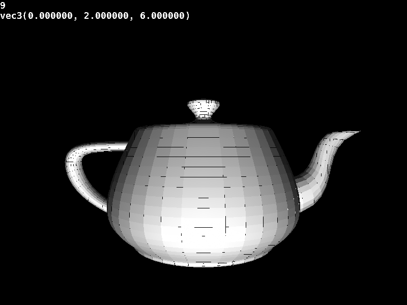

# demo3d

## what?

this is an experiment in software rendering using SDL2 and GLM.  
i am not thinking about performance, i just care about getting results.  
i will not share build instructions because it is just so ugly

## current features

- moveable camera (wasd/arrows)
- can load OBJ files
- flat shading